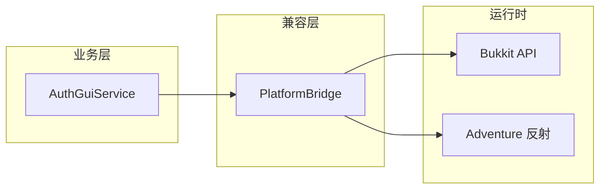

# MinecraftBoxLock / XlingranAuth

当前插件 Maven / `plugin.yml` 版本：**0.0.1**（见 `CHANGELOG.md`）。

我的世界相关仓库；子项目 **XlingranAuth** 为 Spigot / Paper 系插件。

## 适配范围（主流版本）

- **目标**：同一 JAR 在约 **Minecraft 1.12.x** 至 **Paper 26.1.x**（及常见 Spigot / Paper / Purpur 等分支）上运行；**不保证** Folia 等分区线程服。
- **做法概要**：
  - **编译基线**：`spigot-api` **1.12.2**、**Java 8** 字节码，便于旧服加载。
  - **GUI 染色玻璃**：**`Material.matchMaterial`**（1.13+ 扁平化名）+ **1.12.x** 的 `STAINED_GLASS_PANE` 染料值；不依赖 XSeries，避免其在 Paper **26.x** 等新版本号格式下静态初始化失败。
  - **界面与物品展示名**：**`PlatformBridge`** 在插件**启用时探测一次**并缓存：有 `createInventory(..., String)` 则走 Bukkit 字符串路径；否则绑定 **Adventure** 的 `Component` 标题与 `ItemMeta#displayName` / `lore`（反射）；物品元数据单独探测，可与「字符串标题界面」组合（例如仍带 Adventure 的 Paper）。
  - **识别本插件界面**：**`AuthGuiHolder`**，不依赖已弃用的 `Inventory#getTitle()` 字符串比对。




各大版本 **服务端 JVM** 请按官方 Paper/Minecraft 要求（例如 1.17+ 多为 **17**，新 Paper 线多为 **21+**）；插件本身为 **Java 8 class**，由服务端 JVM 加载。

## 构建（无需本机安装 Maven）

仓库含 **Maven Wrapper**。构建需 **JDK 8+**（与 `maven.compiler` 一致即可；你本机 **Zulu 25** 也可用于 `mvnw`）。

- **Windows**：`mvnw.cmd clean package`
- **macOS / Linux**：`chmod +x mvnw`（如需）后 `./mvnw clean package`

首次运行会下载 **Apache Maven 3.9.9** 到本机 Wrapper 缓存。

**Paper 服务端 jar**：从 [Paper 下载](https://papermc.io/downloads/paper) 获取与你的服版本一致的构建，放入 `.debug-server/`（调试脚本默认目录）。

## 本地调试（Cursor / VS Code）

1. 安装 **Extension Pack for Java**（`.vscode/extensions.json`）。
2. 仓库根目录建 **`.debug-server/`**，放入对应版本的 `paper-*.jar` / `spigot-*.jar` 等。
3. **`.debug-server/eula.txt`** 设为 **`eula=true`**。
4. **运行和调试**：可选用「一键: 构建部署 + 起服并附加 (JDWP)」等配置（见 `.vscode/launch.json`）。

环境变量：`DEBUG_MC_MEM`、`DEBUG_MC_JAVA_OPTS`、`JAVA_HOME` / `DEBUG_JAVA_EXE`（见脚本说明）。

一键构建 + 部署 + 起服：

```powershell
powershell -NoProfile -ExecutionPolicy Bypass -File .\scripts\start-debug-server.ps1 -WorkspaceRoot (Get-Location) -Build -Deploy
```

产物：`target/XlingranAuth-*.jar`。

## 升级 / 维护

- **最低侧 API**：`pom.xml` 中 **`spigot.api.version`**（默认 1.12.2）。
- **GUI 材质**：若将来增加强版本相关方块，可再引入材质抽象库或按版本分支处理。
